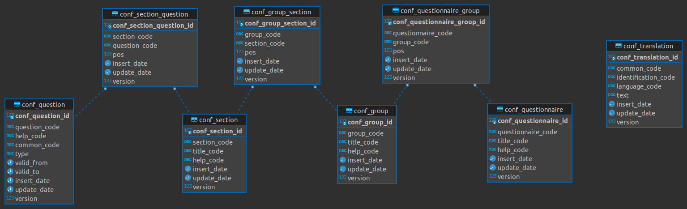

# Q-Manager Core
A questionnaire manager java application.

An example of use of this library can be found in [q-manager-console](https://github.com/AndreiDodu/q-manager-console).

## Structure 

A questionnaire has the following structure:
 - Questionnaire
 - QuestionnaireGroup
 - Group
 - GroupSection
 - Section
 - SectionQuestion
 - Question

## Description

Every question can be translated in different languages thanks to the Translation table.
 
A Questionnaire consists of one or more groups. A group consists of one or more sections and a section consists of one or more questions.

This subdivision allows you to enter a title and a help text at the questionnaire, group or section level.

At the graphic level, a questionnaire is a set of tabs. A group is represented by a tab and a section is a set of questions.

Each group, section or question has an order with respect to its parent. Therefore the groups can be ordered on the basis of the order property of the relationship table between the questionnaire and the group. The same logic applies to the section and to the questions.

## Technologies
- Spring boot
- Hibernate
- Liquibase
- Mapstruct
- Docker
- (JDK 17)

## Here is the DB schema:

## TODO
 - answer insert feature
